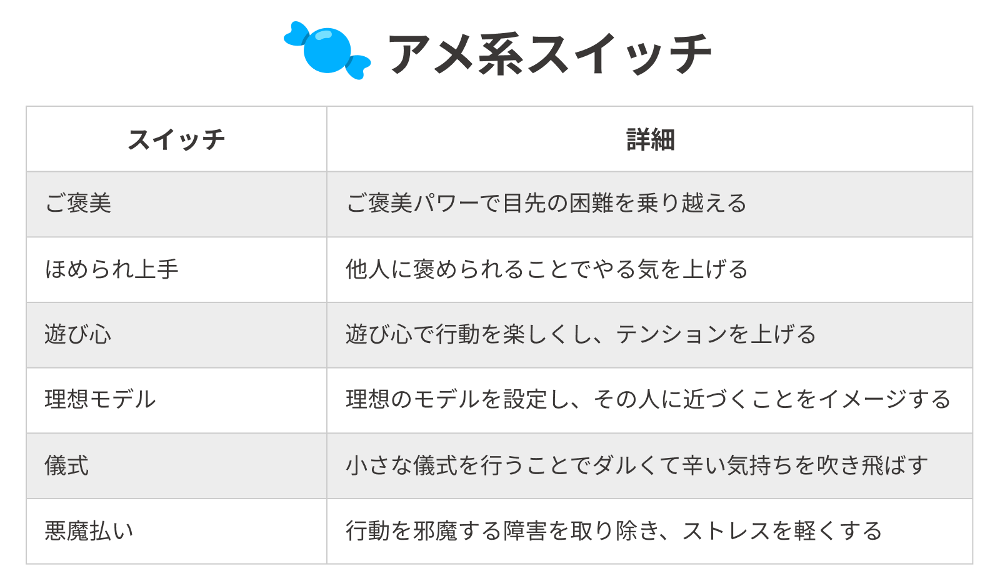
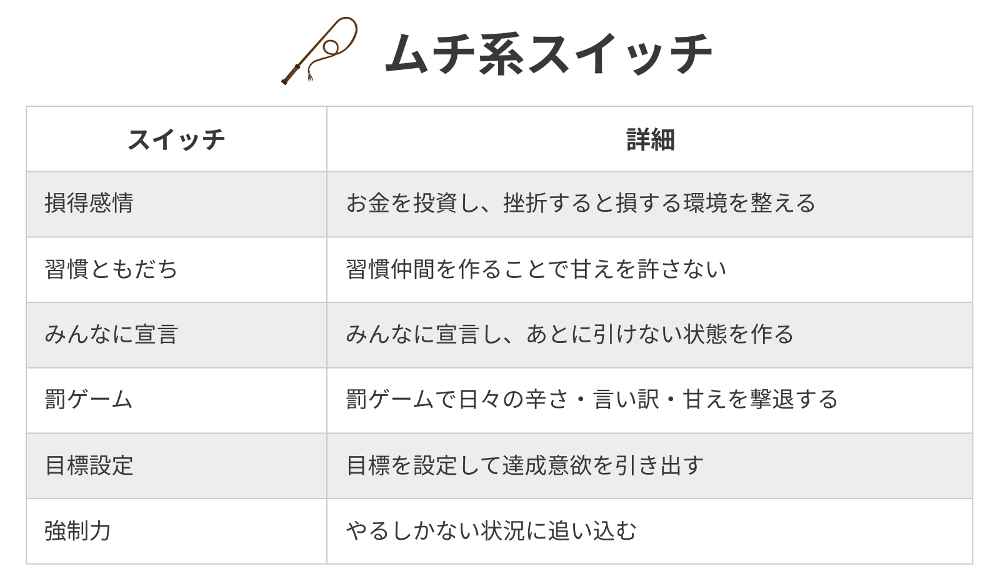

自分でやりたいと思ってはじめたことなのにすぐに挫折してしまうのはなぜでしょうか？

今回は習慣化の本の中でも屈指の名著[『30日で人生を変える「続ける」習慣』](https://www.amazon.co.jp/dp/B014D0E0HQ/ref=dp-kindle-redirect?_encoding=UTF8&btkr=1)（以下「続ける」習慣と略記）の内容を紹介しながら、その疑問に答えたいと思います。

## 継続できないのは「挫折の原因」を知らないから

結論から言うと、あなたが継続に挫折するのは**「挫折の原因」を知らないから**です。

多くの人が「また続けられなかった...」という結果だけにとらわれて「なぜ続けられなかったのか？」という挫折の原因までは考えていません。

じゃあ原因は何なんだよ！と焦る気持ちはわかりますが、ちょっと待ってください。

原因を知るためにはまず**「行動が習慣になるプロセス」**を理解しないといけません。なので少し遠回りになりますが、先に「行動が習慣になるプロセス」について解説させてください。

## 行動が習慣になるプロセス

『「続ける」習慣』では、ある行動が習慣になるまでおよそ**30日間**必要だと述べられています。

そしてその30日間には以下の3つのステップがあります。

- 反発期（とにかくやめたくなる時期）
- 不安定期（予定に振り回される時期）
- 倦怠期（飽きてくる時期）

1つずつ説明します。

### 反発期（1〜7日目）

ある行動を始めると一番最初に迎えるのが反発期です。反発期の特徴は**「とにかくやめたい！」**と思うことです。

反発期の期間は**1〜7日目**ぐらいまでです。

人間の身体には**「変化を嫌い、常に一定の状態を維持する」**という仕組みがあります。人間の体温や性格などは基本的に一定を保っていますよね。これもその仕組みのおかげです。

新しい行動は「変化」として捉えられ、脳はその変化に対して強く抵抗します。その結果「やめたい！」と思い、挫折してしまうのです。

習慣化において反発期に挫折する割合は**42%**となっており、3つのステップの中で最も高い挫折率です。

「三日坊主」という言葉がよく使われるのもこれでうなずけます。

### 不安定期（8〜21日目）

反発期を過ぎると、次に迎えるのが不安定期です。不安定期の特徴は**「仕事や予定に振り回されて思うように行動できずイライラすること」**です。

不安定期の期間は**8〜21日目**ぐらいまでです。

たとえば、仕事終わりに英語の勉強をしようと思っても残業が続いたり、同僚に飲みに誘われたりするとなかなか思い通りに勉強が進まないことありませんか？そうなるとイライラしてきますよね。

すると「もうどうでもいい！つまらない！」となり挫折してしまいます。

不安定期の挫折率は**40%**と反発期と同様に高い割合となっています。

### 倦怠期（22〜30日目）

反発期を過ぎると、最後に迎えるのが倦怠期です。倦怠期の特徴はその名の通り**「飽きてくること」**です。

倦怠期の期間は**22〜30日目**くらいまでです。

ここまで来ると、ある程度行動を起こすことに対しては慣れてきます。ですが、慣れてくるがゆえに飽きてくるんです。つまり**「マンネリ化」**です。

マンネリを感じると「なんだか物足りないな」「これやってて意味あるのかな？」という心の声が聞こえてきて脳がやらない理由を考え始めます。結果、行動をしなくなり挫折します。

倦怠期の挫折率は**18%**と反発期、不安定期に比べるとグッと下がっているのがわかります。

この倦怠期を乗り越えるとようやく行動が習慣として定着します。

## 挫折の原因は時期によって異なる
ここまで「行動が習慣になるまでの3つのステップ」について説明しました。まとめると以下のようになります。

- 反発期：脳が強く変化に抵抗しているのが原因
- 不安定期：予定に振り回されて思うように行動できないのが原因
- 倦怠期：飽きを感じて、脳がやらない理由を考えるのが原因

このように、一言で「挫折」と言っても**時期によってその原因は大きく異なる**のです。

しかし、挫折の原因を知れば、それに対する対策を考えることもできます。ではその対策について説明しましょう。

## 3つのステップに対する解決策

ここまでで「挫折の原因は時期によって異なる」ということをお伝えしました。ということは原因に対する解決策も各時期に応じて異なるということです。

では、ここからは3つのステップに応じた解決策を紹介します。

### 反発期の解決策

反発期の解決策は以下の2つです。

- 小さく始める
- シンプルに記録する

#### 小さく始める

反発期の1つめの解決策は**「小さく始める」**です。

反発期はとにかく脳が変化に対して強く抵抗している時期です。この抵抗を無くすためには**「最小の行動から始めて、変化を緩やかにする」**ことが重要です。

たとえば、読書を習慣化しようと思ったら、まずは「1日2ページ」だけ読むことからはじめます。これなら2分で終わるので誰でもできるし、大した負荷もかかりません。

このように、まずは「本を読む」という行動自体を脳に刷り込みます。

すると読書をすることが「常」となり、やがて脳の抵抗はゼロになります。そしたら徐々に目標を上げていけばいいのです。

#### シンプルに記録する

反発期の2つめの解決策は**「シンプルに記録する」**です。

行動を記録すると、自分の行動を定量的に可視化できるので自分に自信が持てるようになりモチベーションが上がります。モチベーションが上がると「またやろう！」という気持ちが湧いてきます。

また記録すると「やった or やらなかった」が明確になるので曖昧さがなくなります。

ただし「いつ・どこで・何を・どれくらい行ったか」を記録するのはめんどくさいはず。だから**「シンプルに」**記録します。

オススメは[「habitify」](https://www.habitify.me/)というアプリです。やったかやっていないかをシンプルに記録することができるし、これまでどれくらい行ったかも見ることができます。

見た目もおしゃれで使いやすいのでぜひ使ってみてください。

### 不安定期の対策

反発期の解決策は以下の3つです。

- パターン化する
- 例外ルールを設ける
- 継続スイッチをセットする

#### パターン化する

不安定期の1つめの解決策は**「パターン化する」**です。

先ほど述べたように、不安定期の特徴は「仕事や予定に振り回されて思うように行動できずイライラすること」です。

これに対する解決策はシンプルで**「いつ・どこで・何をやるかを決めてしまうこと」**です。

毎日「今日はいつやろうかな〜？」と考えるからやらないんです。

あらかじめ「毎日仕事終わったらカフェに1時間こもって英語の問題集をやる」とか「朝起きてシャワーを浴びたら30分読書をする」とパターンを決めましょう。

#### 例外ルールを設ける

不安定期の2つめの解決策は**「例外ルールを設ける」**です。

パターン化したとは言え、毎日完璧に行動を継続できたら誰も苦労しませんよね？

「残業で帰りが遅くなった」とか「飲みすぎて寝坊した」などイレギュラーは必ず発生します。

このイレギュラーに対して効果を発揮するのが「例外ルール」です。

例外ルールとは**「イレギュラーな出来事で本来やるべきことができないときに、あらかじめやることをルールとして決めておくこと」**です。

たとえば、寝坊して「30分も読書ができない！」という場合は「2ページだけ読書をする」という例外ルールを作っておくのです。

こうすることによって「やらない日」をなくすことができます。

このように、例外ルールはやらない日をなくし、挫折することを防ぐのに非常に役立ちます。

#### 継続スイッチをセットする

不安定期の3つめの解決策は**「継続スイッチをセットする」**です。

継続スイッチとは簡単に言えば「継続のモチベーションをあげるツボ」みたいなものです。

最も代表的な例として「自分へのごほうび」があります。「1週間勉強を継続できたら表参道で人気のカフェでスイーツを食べる」のように自分にご褒美をあたえてやる気を引き出すのよくやりますよね。あれです。

『「続ける」習慣』では継続スイッチをアメ系とムチ系の2種類に分類しています。それぞれ6種類ずつあります。以下にまとめたので参考にして下さい。

どのスイッチがやる気を引き出すかは人によって異なります。自分が最もモチベーションが上がるものを選択しましょう。

不安定期では、この継続スイッチを1つないしは2つ選択し、行動を持続させるようにします。

### 倦怠期の対策

倦怠期の解決策は以下の2つです。

- 変化をつける
- 次の習慣を計画する

#### 変化をつける

倦怠期の1つめの解決策は**「変化をつける」**です。

ランニングでずっと同じ景色を見ながら走るのが辛いのと同じように、人間はずっと同じ行動を続けていると、飽きが来てやる気を失っていきます。

倦怠期はまさにこの「飽き」が来ている時期なので、景色を変えて飽きが来ないようにする必要があります。

変化をつける方法は「いつもと違うカフェ勉強する」のように場所を変えたり、「いつもと違う教材で勉強する」のように内容を変えたりすることが挙げられます。

#### 次の習慣を計画する

倦怠期の2つめの解決策は**「次の習慣を計画する」**です。

次の習慣を計画することの効果は**「今の努力が通過点に思える」**ことです。これは先を見据えると言い換えることもできます。

たとえば、全国大会優勝を目標にすれば、県大会優勝や関東大会優勝はただの通過点で、達成するのが当たり前と思えるようになります。

同じように、いま英語学習の習慣化に取り組んでいるなら、次は英語学習で学んだことをブログに書くことを習慣化しようと計画を立てます。

すると現在の英語学習を習慣化した先にブログを書くことがあるので、英語学習がただの通過点に感じられ、道のりが楽になります。

## まとめ
今回は**習慣化に挫折する原因が、時期によって大きく異なる**ことを述べました。

行動が習慣になるまでには以下3つのステップがありました。

- 反発期：1〜7日目
- 不安定期：8〜21日目
- 倦怠期：22〜30日

そしてそれぞれの時期に応じた対策は以下の通りです。

#### 反発期
- 小さく始める
- シンプルに記録する

#### 不安定期

- パターン化する
- 例外ルールを設ける
- 継続スイッチをセットする

#### 倦怠期

- 変化をつける
- 次の習慣を計画する

習慣化はテクニックで攻略できます。原因がわかって対策を講じれば必ず実現できるものです。

今回の記事を参考にして、ぜひみなさんも習慣化に取り組んでみてください。