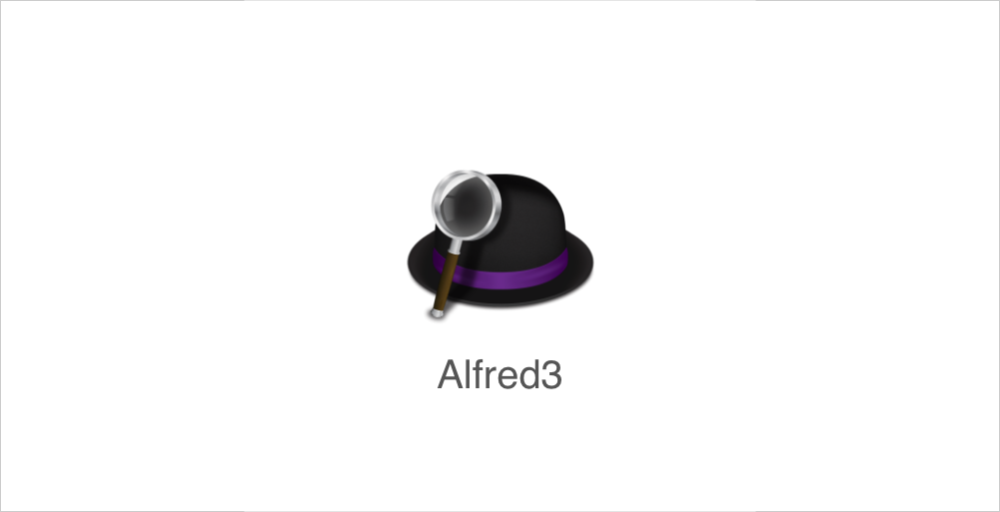
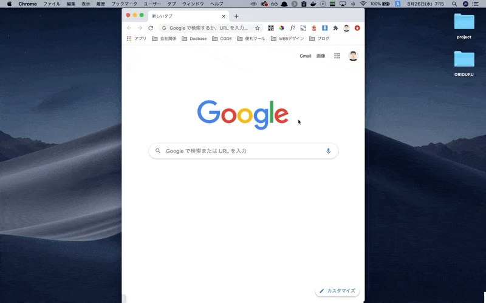
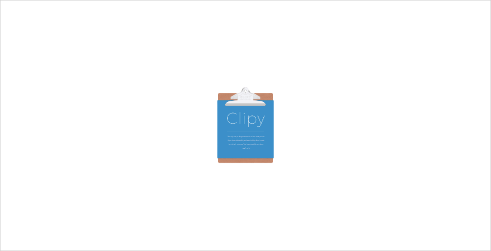
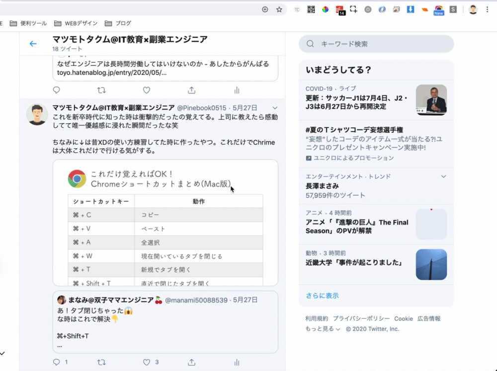
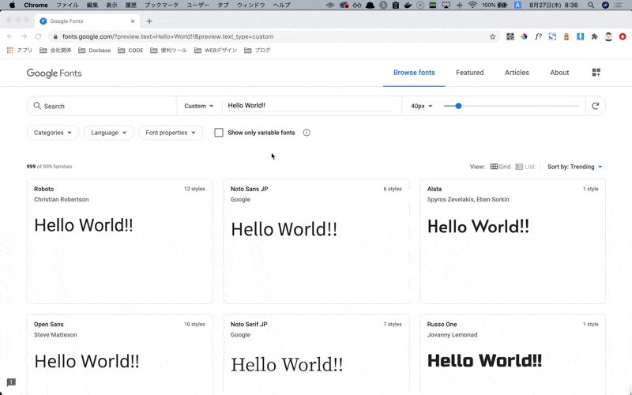
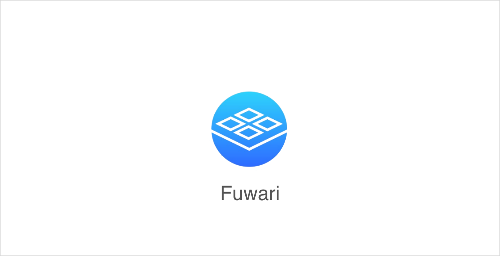

こんにちは、マツモトタクムです。

さて、今回は仕事における生産性について書きたいと思います。

生産性を決める要素はたくさんありますが、その中でも最も影響度が大きいのがパソコンスキルでしょう。

パソコンスキルを細かく分解すると以下の4つに分けられます。

1. タイピング速度
2. ショートカットを使いこなすスキル
3. 便利なアプリを使いこなすスキル
4. 自動化スキル

今回は上記の中でも3つめの**「便利なアプリを使いこなすスキル」**について書きたいと思います。

学生時代からずっとMacを使い続けている自分が「これが無いと仕事にならない！」と思う最強のアプリ7選を紹介します。

## 1. Google日本語入力

1つ目は**「Google日本語入力」**です。

これはGoogleが提供している日本語変換アプリです。Macにデフォルトで入っている変換ソフトよりも文字変換や予測候補機能が優秀です。

無料ですし、インストールするだけでその恩恵が得られるので、むずかしいことは考えずにインストールしてしまいましょう。

ダウンロードは[こちら](https://www.google.co.jp/ime/)からできます。

## 2. Alfred3

2つ目は**「Alfred3」**です。

これはいわゆるランチャーアプリに分類されるアプリです。ランチャーアプリとは、アプリを起動したり、Mac内のファイルなどを検索したりするためのアプリです。

Macにはデフォルトで「Spotlight」というランチャーアプリが入っているのですが、それよりもはるかに使いやすく、さらに高機能なのが「Alfred3」です。しかも無料。入れない理由が見当たりません。

Alfredは、使いこなせば実に多くのことができます。今回はその中でも僕が最も優れていると思う機能を1つ紹介します。それは**「よく使うWebサイトを一瞬で呼び出すこと」**です。

たとえば、ユニクロのWebサイトを見たいと思ったときに、Alfredにユニクロのサイトを登録しておけば、以下の動画のように一瞬でサイトを呼び出すことができます。

このようにAlfredに仕事などで毎日見るサイトを登録しておけば、わざわざブックマークをポチポチして開く必要もありません。この機能だけでもインストールする価値があります。

ぜひMacユーザーの方は入れてみてください。ダウンロードは[こちら](https://www.alfredapp.com/)からできます。

## 3. Spectacle

3つ目は**「Spectacle」**です。

これは画面分割を行うためのアプリです。

アプリのウィンドウの大きさをいちいちマウスドラッグで調節していませんか？そんなことは人間のやることじゃありません。

Spectacleを使えば、キーボード操作で以下の動画のように、全画面表示、上下左右寄せ、中央寄せが一瞬でできるようになります。

これによって複数のアプリを左右に分割しながら作業するなんてこともサクサクとできてしまいます。

ダウンロードは[こちら](https://www.spectacleapp.com/)からできます。

※類似アプリで[Magnet](https://apps.apple.com/jp/app/magnet-%E3%83%9E%E3%82%B0%E3%83%8D%E3%83%83%E3%83%88/id441258766?mt=12)もあるそうです。

## 4. HyperSwitch

4つ目は**「HyperSwitch」**です。

これはMacのアプリ切り替え機能を拡張してくれるアプリです。（※現在開発が止まっているようで、最新のOSだと起動しない場合があります。）

Macでアプリを切り替えるショートカットキーは「⌘ + tabキー」ですが、デフォルトの状態だと、アプリ単位での切り替えしかできません。

「アプリ単位での切り替えしかできない」とは、たとえばGoogle Chromeで複数のウィンドウを開いていても、デフォルトの状態だと「⌘ + tabキー」では、そのウィンドウ間の切り替えができないのです。

Windowsでは「Alt + tabキー」でウィンドウ単位での切り替えができるのですが、Macではそれができません。意外とこれが不便なんですよね。

HyperSwitchを入れると、以下の動画のようにウィンドウ単位での切り替えが可能になります。（以下の動画では、Google Chrome上で複数ウィンドウを開き、それを切り替えています）

これを入れると確実にマウス操作が減るので、作業スピードが確実に上がります。まだ入れてない人はぜひインストールしましょう。

ダウンロードは[こちら](https://bahoom.com/hyperswitch)からできます。

## 5. Clipy

5つ目は**「Clipy」**です。

これは「⌘ + C」でクリップボードにコピーした内容の履歴を残してくれるアプリです。Windowsだと「Clibor」が同種のアプリに該当します。結構有名なアプリなので、もしかしたら入れている人も多いかもしれません。

通常、コピー&ペーストをするときは、直近にコピーした内容しか貼り付けることができませんが、Clipyを使うと、それ以前の履歴を呼び出し、貼り付けることができます。

もう1つ、僕がClipyの中でおすすめの機能が**「スニペット機能」**です。スニペット機能とは、要は「定型文」を登録する機能のことです。

さきほどのクリップボードの履歴を呼び出すのとは別で、事前に登録しておいた定型文をキーボード操作で一瞬で呼び出すことができます。

僕はドキュメントを書くときや、仕事上のチャットツールで文章を書くときは、なるべくフォーマットを統一して、中身だけを変えるようにしています。

そんなとき、このスニペット機能を使って定型文を呼び出せば、中身を変えるだけで、すばやく文章を書くことができます。他にもよく使うプログラムのコードなんかも登録しています。

クライアントとのメールのやりとりなどで決まったフォーマットの文章を書くことが多い人には特におすすめです。

ダウンロードは[こちら](https://clipy.softonic.jp/mac)からできます。

## 6. CleanShot X

6つ目は**「CleanShot X」**です。

これはスクリーンショットや画面キャプチャを撮るためのアプリです。Macにはデフォルトでスクリーンショットを撮る機能がありますが、その機能をさらに拡張したものになります。

**ちなみにこのアプリは有料です。値段は買い切りで$29です。**ちょっと高いと思うかもしれませんが、値段に見合う価値はあります。30日返金保証もあるので、まずは試してみるのが良いでしょう。

このアプリは、とにかく多機能なので、すべてを紹介するのは難しいのですが、主な機能だけでも以下があります。

- スクショした画像を即編集→SlackやLINEに即貼り付け
- スクショした画像をウィンドウ最上部にフロート
- GIFアニメ撮影

それぞれ詳しく解説します。

### スクショした画像を即編集→SlackやLINEに即貼り付け
チャットなどでやりとりをしていると、画像を添付して説明したほうが、説明がしやすい場合があります。

その際、画像に注釈や印をつけて該当箇所を示したいこともあるでしょう。そんなときにこの機能がとても役に立ちます。以下の動画を見てください。

通常、撮ったスクショを編集し、チャットに投稿しようとしたら、以下のような工程が必要になります。

1. スクショを撮る
2. 撮ったスクショをパソコンにダウンロードする
3. 画像編集用のアプリを開き、編集する
4. 編集した画像を保存する
5. 編集した画像をチャットに投稿する

しかし、CleanShot Xを使えば、上記の工程をすべて1つのアプリで完結させることができます。

また、画像は保存せずに編集・投稿ができるので無駄にパソコンの容量をひっ迫することもありません。上記の動画では編集した画像を保存せず、そのままドラッグ&ドロップでSlackに投稿しています。

### スクショした画像をウィンドウ最上部にフロート
これは範囲指定した部分を常にウィンドウの最上部に浮かせることができる機能です。まずはどんな機能かイメージを持ってもらうために、以下の動画を見てください。

このように、範囲指定で切り取った部分を画面上に浮かせることができます。「一体何に使うんだ？」と思われるかもしれませんが、意外にいろんなことに使えます。

上記の動画のように、デザインの比較をしたり、付箋メモのように使ったり、とにかく用途は幅広いです。

フロートさせた画像は常にウィンドウの最上部に浮いているので、例えばGoogle Chrome上で画像を切り取り、別アプリ（SlackやTwitterなど）に切り替えたとしても、画像はそのアプリよりも手前に表示されます。

### GIFアニメ撮影
これはタイトルそのままの機能です。

この記事にあるGIFアニメはすべてこの機能を使って撮影しています。自分のように画面収録を頻繁にする人にはとても重宝する機能です。

以上がCleanShot Xの主な機能です。他にもたくさん機能があって、設定も細かくいじれるので自分が使いやすいようにカスタマイズすることが可能です。

ダウンロードは[こちら](https://cleanshot.com/)からできます。

## 7. Fuwari

7つ目は**「Fuwari」**です。

これは「CleanShot X」の2つめの機能で紹介した「スクショした画像をウィンドウ最上部にフロート」に特化したアプリです。

CleanShot Xのようにスクショした画像を編集することはできませんが、最速でスクショをフロートさせることができます。

スクショした画像は「⌘ + C」でクリップボードにコピーして、そのままサクッとSlackなどのチャットツールに貼り付けることができます。

他にも画像として保存、拡大/縮小、削除などの操作をショートカットキーのみでマウスを使わずに操作することができます。

こちらのアプリは無料です。CleanShot Xが高いなと思う人はこのアプリだけでもぜひインストールしましょう。

ちなみに僕はスクショした画像を編集したいときは「CleanShot X」、編集が不要なときは「Fuwari」と使用用途によって使い分けています。

ダウンロードは[こちら](https://fuwari-app.com/)からできます。

このアプリ開発者が書いたアプリ紹介の記事は[こちら](https://qiita.com/kentya6/items/00599091bd987b5fa797)から見れます。

## おわりに
以上、絶対に入れるべき最強のMacアプリ7選でした。1つでも入れていない人はぜひインストールしてみてください。

便利なアプリを使わないというのは、水道があるのにも関わらず、井戸から水を汲んで生活をするようなものです。

楽できることはなるべく楽をして、よりクリエイティブなことに時間を使うようにしましょう。