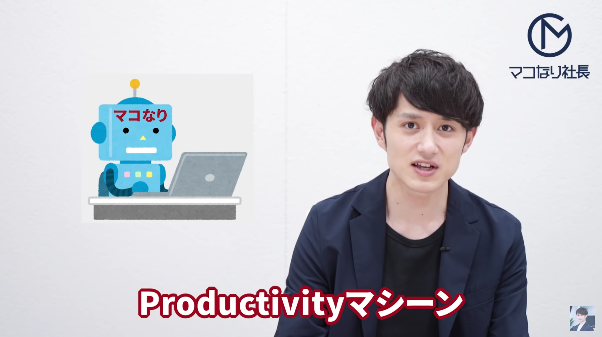

今回は**【マコなり社長流】仕事で圧倒的に生産性を上げる3つの方法**というテーマで書こうと思います。

みなさん「マコなり社長」って知っていますか？

知らない人のために言っておくと、株式会社divという会社を経営をしていて、かつ登録者数90万人超えのビジネス系Youtuberです。最近はかなり知名度が上がってきたように思います。

詳しくはYoutubeを見てほしいのですが、彼は**「生産性を極めたProductivityマシーン」**と自称するくらい生産性にはこだわって生きています。

そして僕は現在、その株式会社divで働いています。当然そんな人のもとで働くわけですから、僕ら社員にも高い生産性が求められます。

今回はそんなマコなり社長の会社で働くイチ社員が実際に生産性を上げるために行っているテクニックを3つ紹介します。

この記事を書いた動機は、Youtubeで紹介されている生産性を上げるテクニックを見ても**「実際にやっている人は少ないだろうな」**と思ったからです。

みんな本とかTwitterとかYoutubeとかで言われている仕事術を見て、その瞬間は「ふむふむ、良さそう！」と思いながら高評価ボタンを押したり、RTをしたりするんです。

著名人や人気ユーチューバーが言っているとそれっぽく聞こえますからね。気持ちは一定わかります。

**でも実際にやっている人はほとんどいない。**それが現状だと思います。

だからこそ、マコなり社長ではなくその会社で働いているイチ社員の意見に価値があると思い、この記事を書きました。

結論、自分はまだまだビジネスマンとしては未熟かもしれませんが、それでも**このテクニックを実践する前に比べたらはるかに生産性が上がったと断言できます。**

これは身内贔屓をするわけではなく、本当に身につけてよかったと心の底から思えるテクニックです。

どの会社でも使えるテクニックなのでぜひ参考にして下さい！

<!-- 今回は**【マコなり社長流】仕事で圧倒的に生産性を上げる3つの方法**というテーマで書こうと思います。

現在、僕は株式会社divという会社で働いています。

知らない人のほうが多いと思いますが、もしかしたら**「マコなり社長」**というビジネス系Youtuberは聞いたことがある人もいるかもしれません。

株式会社divはそのマコなり社長が経営している会社です。

詳しくはYoutubeを見てほしいのですが、彼は自分のことを**「生産性を極めたProductivityマシーン」**と言うくらい生産性にはこだわって生きています。

そんな人のもとで働くわけですから当然ぼくら社員にも高い生産性が求められます。

今回はそんな**マコなり社長の会社で働くイチ社員の僕が実際に生産性を上げるために行っているテクニックを3つ紹介します。**

決して自分のことを圧倒的な生産性を誇るビジネスマンと言いませんが、それでもこのテクニックを実践する前に比べたらはるかに生産性が上がったと断言できます。

これは身内贔屓をするわけではなく、本当に身につけてよかったと心の底から思えるテクニックです。

どの会社でも使えるテクニックなのでぜひ参考にして下さい！ -->

## 紙に思考を書き出すこと

仕事で圧倒的に生産性を上げるテクニックの1つめは**「紙に思考を書き出すこと」**です。

紙に書き出すことによって頭の中を整理し、思考を深めていくことが可能になります。

仕事中「うーん...」と考え込むことありますよね。むずかしい顔をしながら、腕を組んで、天を仰いでも思考は堂々巡りで全く前に進んでいない。
よく見る光景です。

でも、はっきり言ってその時間意味ないです。**なぜならそれは考えているフリだからです。**

考えるとは**「言語化する」**ということです。

言語化して文章という形で紙に書き出すことで、頭の中のフワフワしたアイディアや考えをカチッと明確に表現することができます。

そして紙に書き出された思考はもう頭の中に留めておく必要がなくなるので、その分脳のメモリが解放され、次の思考にメモリを使うことができます。

僕の会社にはデスクの至るところにA4のコピー用紙が積んであります。みんな何か思考に詰まったら、すぐその紙を取り、紙に書き出しています。

僕も1日20枚ぐらいは余裕で使います。もはや何かを考えるときに紙に書き出さないで思考しようとしていた過去の自分が恐ろしいです。たぶん何も考えていなかったと思います。

それぐらい紙に書き出すことは思考を深めるのに効果があるので、ぜひ今日から紙をPCの横に置いて作業しましょう。

## こまめに共有すること
仕事で圧倒的に生産性を上げるテクニックの2つめは**「こまめに共有すること」**です。

作業の進捗をこまめに共有することによって、やり直しコストを最小限に抑えることができます。

仕事において最も無駄な時間は**「やり直し」**です。

どんなに作業が爆速な人でも、何回もやり直しが発生している人は仕事が遅いです。

逆に言えば、作業1つ1つのスピードが多少遅くてもやり直しがゼロであれば仕事は速くなります。

ここで忘れてはならないことは、**仕事の完成は基本的に上司（あるいはクライアント）が判断する**ということ。

だからこそ上司がイメージしている完成像とズレがないように、早い段階から「こんな感じで進めようと思います」と共有し、上司と認識の一致を図ることが大事です。

僕はこのイメージの共有を完成度が2割・5割・8割の段階で行います。僕の会社では通称**「2・5・8割共有」**なんて言われています。全然通称になっていませんね。

## 時間を宣言すること
仕事で圧倒的に生産性を上げるテクニックの3つめは**「時間を宣言すること」**です。

これはいわゆる「締め切り効果」を使ったテクニックです。

上司やクライアントに「◯時までに提出します！」と言ってしまえば、なんとしてもその時間までに終わらせようと努力しますよね。めっちゃシンプルな話です。

ポイントは**「今日の何時までに終わらせるか」を宣言すること**です。

仕事の内容によっては1日で終わらない業務もあるでしょう。作業が膨大で1週間掛かる仕事もあります。

その場合でも「今日の◯時までにどの作業を終わらせるのか」を宣言しましょう。

**基本的に仕事というのは細かいタスクの集合体です。**

全体で1週間程度掛かる仕事であっても1つ1つのタスクに分解すれば、それぞれどれくらい時間がかかるか見積もることができます。

そうやってタスクを分解したうえで「今日の◯時までにこのタスクを終わらせます！」と宣言するのです。

そうすれば締め切り効果によって毎日生産性高く仕事に取り組むことができます。

## おわりに
今回はマコなり社長の会社で働くイチ社員の僕が**「仕事で圧倒的に生産性を上げる3つの方法」を紹介しました。**

どれも言われてみれば当たり前かもしれませんが、それでもこれを書いたのは冒頭で言ったように**「実際にやっている人があまりにも少ないから」**です。

**行動が伴わないインプットに価値はありません。**本当に意味ない。というか時間がもったいない。やらないなら最初からアニメを見たり、ゲームをしたほうが人生楽しいです。

だから騙されたと思ってぜひやってみてください。今回紹介した中の1つだけでもいいのでやってください。何かしら変化があるはずです。

そうやって実際に試して自分にとって最適化していくことが本当に生産性を上げることです。

ぜひこれを読んだ人の行動が変わってくれるとうれしいです。